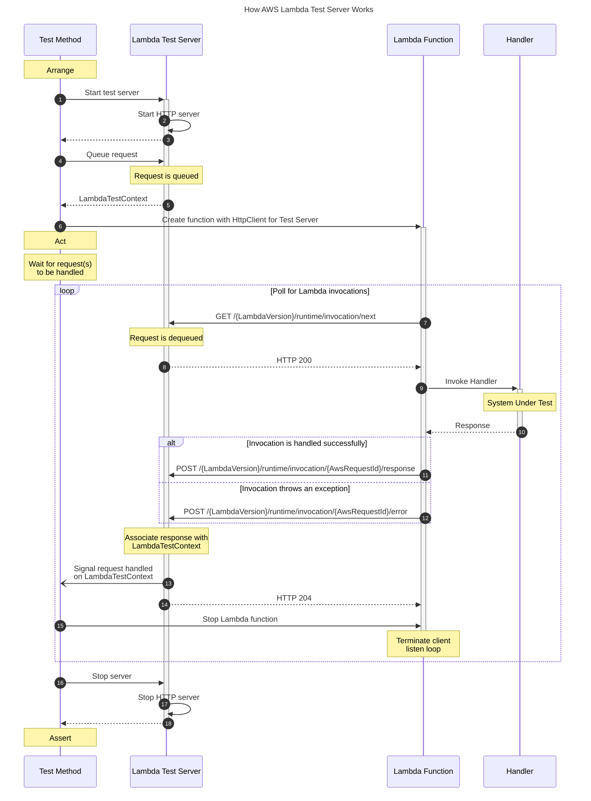

# AWS Lambda Test Server for .NET

[![NuGet][package-badge-version]][package-download]
[![NuGet Downloads][package-badge-downloads]][package-download]

[![Build status][build-badge]][build-status]
[![codecov][coverage-badge]][coverage-report]
[![OpenSSF Scorecard][scorecard-badge]][scorecard-report]

## Introduction

A NuGet package that builds on top of the `TestServer` class in the [Microsoft.AspNetCore.TestHost][testhost] NuGet package to provide infrastructure to use with end-to-end/integration tests of .NET 6 AWS Lambda Functions using a custom runtime with the `LambdaBootstrap` class from the [Amazon.Lambda.RuntimeSupport][lambda-runtime-support] NuGet package.

[_.NET Core 3.0 on Lambda with AWS Lambda's Custom Runtime_][custom-lambda-runtime]

### Installation

To install the library from [NuGet][package-download] using the .NET SDK run:

```sh
dotnet add package MartinCostello.Testing.AwsLambdaTestServer
```

### Usage

Before you can use the Lambda test server to test your function, you need to factor your function entry-point
in such a way that you can supply both a `HttpClient` and `CancellationToken` to it from your tests. This is to allow you to both plug in the `HttpClient` for the test server into `LambdaBootstrap`, and to stop the Lambda function running at a time of your choosing by signalling the `CancellationToken`.

Here's an example of how to do this with a simple Lambda function that takes an array of integers and returns them in reverse order:

```csharp
using Amazon.Lambda.RuntimeSupport;
using Amazon.Lambda.Serialization.Json;

namespace MyFunctions;

public static class ReverseFunction
{
    public static async Task Main()
        => await RunAsync();

    public static async Task RunAsync(
        HttpClient httpClient = null,
        CancellationToken cancellationToken = default)
    {
        var serializer = new JsonSerializer();

        using var handlerWrapper = HandlerWrapper.GetHandlerWrapper<int[], int[]>(ReverseAsync, serializer);
        using var bootstrap = new LambdaBootstrap(httpClient ?? new HttpClient(), handlerWrapper);

        await bootstrap.RunAsync(cancellationToken);
    }

    public static Task<int[]> ReverseAsync(int[] values)
        => Task.FromResult(values.Reverse().ToArray());
}
```

Once you've done that, you can use `LambdaTestServer` in your tests with your function to verify how it processes requests.

Here's an example using xunit to verify that `ReverseFunction` works as intended:

```csharp
using System.Text.Json;
using MartinCostello.Testing.AwsLambdaTestServer;
using Xunit;

namespace MyFunctions;

public static class ReverseFunctionTests
{
    [Fact]
    public static async Task Function_Reverses_Numbers()
    {
        // Arrange
        using var shutdownAfter = new CancellationTokenSource(TimeSpan.FromSeconds(1));

        using var timeout = CancellationTokenSource.CreateLinkedTokenSource(
            shutdownAfter.Token,
            TestContext.Current.CancellationToken);

        using var server = new LambdaTestServer()
        {
            OnInvocationCompleted = async (_, _) => await shutdownAfter.CancelAsync(),
        };

        await server.StartAsync(timeout.Token);

        int[] value = [1, 2, 3];
        string json = JsonSerializer.Serialize(value);

        LambdaTestContext context = await server.EnqueueAsync(json);

        using var httpClient = server.CreateClient();

        // Act
        await ReverseFunction.RunAsync(httpClient, timeout.Token);

        // Assert
        Assert.True(context.Response.TryRead(out LambdaTestResponse? response));
        Assert.True(response.IsSuccessful);

        json = await response.ReadAsStringAsync();
        int[]? actual = JsonSerializer.Deserialize<int[]>(json);

        Assert.NotNull(actual);
        Assert.Equal([3, 2, 1], actual);
    }
}
```

The key parts to call out here are:

  1. An instance of `LambdaTestServer` is created and then the `StartAsync()` method called with a `CancellationToken` that allows the test to stop the function. In the example here the token is signalled with a timeout, but you could also write code to stop the processing based on arbitrary criteria.
  1. The request that the Lambda function should be invoked with is passed to `EnqueueAsync()`. This can be specified with an instance of `LambdaTestRequest` for fine-grained control, but there are overloads that accept `byte[]` and `string`. You could also make your own extensions to serialize objects to JSON using the serializer of your choice.
  1. `EnqueueAsync()` returns a `LambdaTestContext`. This contains a reference to the `LambdaTestRequest` and a `ChannelReader<LambdaTestResponse>`. This channel reader can be used to await the request being processed by the function under test.
  1. Once the request is enqueued, an `HttpClient` is obtained from the test server and passed to the function to test with the cancellation token and run by calling `RunAsync()`.
  1. Once the function processing completes after the `CancellationToken` is signalled, the channel reader is read to obtain the `LambdaTestResponse` for the request that was enqueued.
  1. Once this is returned from the channel reader, the response is checked for success using `IsSuccessful` and then the `Content` (which is a `byte[]`) is deserialized into the expected response to be asserted on. Again, you could make your own extensions to deserialize the response content into `string` or objects from JSON.

The library itself targets `net8.0` and `net9.0` so requires your test project to target at least .NET 8.

#### Sequence Diagram

The sequence diagram below illustrates the flow of events for a test using the test server for the above example.



<!--
Generated with https://mermaid.live/.
-->

### Examples

You can find examples of how to factor your Lambda function and how to test it:

  1. In the [samples][samples];
  1. In the [unit tests][tests] for this project;
  1. How I use the library in the tests for my own [Alexa skill][skill].

### Advanced Usage

#### AWS Mobile SDK with Cognito

If you use either the `ClientContext` or `Identity` properties on `ILambdaContext` in your function, you can specify the serialized JSON for either property as a `string` when enqueueing a request to the test server to be made available to the function invocation.

An example of providing these values from an xunit test is shown below:

```csharp
using System.Text.Json;
using MartinCostello.Testing.AwsLambdaTestServer;
using Xunit;

namespace MyFunctions;

public static class ReverseFunctionWithMobileSdkTests
{
    [Fact]
    public static async Task Function_Reverses_Numbers_With_Mobile_Sdk()
    {
        // Arrange
        using var shutdownAfter = new CancellationTokenSource(TimeSpan.FromSeconds(1));

        using var timeout = CancellationTokenSource.CreateLinkedTokenSource(
            shutdownAfter.Token,
            TestContext.Current.CancellationToken);

        using var server = new LambdaTestServer()
        {
            OnInvocationCompleted = async (_, _) => await shutdownAfter.CancelAsync(),
        };

        await server.StartAsync(timeout.Token);

        int[] value = [1, 2, 3];
        string json = JsonSerializer.Serialize(value);
        byte[] content = Encoding.UTF8.GetBytes(json);

        var request = new LambdaTestRequest(content)
        {
            ClientContext = """{ "client": { "app_title": "my-app" } }""",
            CognitoIdentity = """{ "identityId": "my-identity" }""",
        };

        LambdaTestContext context = await server.EnqueueAsync(json);

        using var httpClient = server.CreateClient();

        // Act
        await ReverseFunction.RunAsync(httpClient, timeout.Token);

        // Assert
        Assert.True(context.Response.TryRead(out LambdaTestResponse? response));
        Assert.True(response.IsSuccessful);

        json = await response.ReadAsStringAsync();
        int[]? actual = JsonSerializer.Deserialize<int[]>(json);

        Assert.NotNull(actual);
        Assert.Equal([3, 2, 1], actual);
    }
}
```

#### Lambda Runtime Options

If your function makes use of the various other properties in the `ILambdaContext` passed to the function, you can pass an instance of `LambdaTestServerOptions` to the constructor of `LambdaTestServer` to change the values the server provides to `LambdaBootstrap` before it invokes your function.

Options you can specify include the function memory size, timeout and ARN.

> The test server does not enforce these values at runtime, unlike the production AWS Lambda environment. They are provided for you to drive the usage of such properties in the code you are testing and should not be relied on to ensure that your function does not take too long to execute or uses too much memory during execution or any other constraints, as appropriate.

An example of this customisation for an xunit test is shown below:

```csharp
using System.Text.Json;
using MartinCostello.Testing.AwsLambdaTestServer;
using Xunit;

namespace MyFunctions;

public static class ReverseFunctionWithCustomOptionsTests
{
    [Fact]
    public static async Task Function_Reverses_Numbers_With_Custom_Options()
    {
        // Arrange
        using var shutdownAfter = new CancellationTokenSource(TimeSpan.FromSeconds(1));

        using var timeout = CancellationTokenSource.CreateLinkedTokenSource(
            shutdownAfter.Token,
            TestContext.Current.CancellationToken);

        var options = new LambdaTestServerOptions()
        {
            FunctionMemorySize = 256,
            FunctionTimeout = TimeSpan.FromSeconds(30),
            FunctionVersion = 42,
        };

        using var server = new LambdaTestServer(options)
        {
            OnInvocationCompleted = async (_, _) => await shutdownAfter.CancelAsync(),
        };

        await server.StartAsync(timeout.Token);

        int[] value = [1, 2, 3];
        string json = JsonSerializer.Serialize(value);

        LambdaTestContext context = await server.EnqueueAsync(json);

        using var httpClient = server.CreateClient();

        // Act
        await ReverseFunction.RunAsync(httpClient, timeout.Token);

        // Assert
        Assert.True(context.Response.TryRead(out LambdaTestResponse? response));
        Assert.True(response.IsSuccessful);

        json = await response.ReadAsStringAsync();
        int[]? actual = JsonSerializer.Deserialize<int[]>(json);

        Assert.NotNull(actual);
        Assert.Equal([3, 2, 1], actual);
    }
}
```

#### Logging from the Test Server

To help diagnose failing tests, the `LambdaTestServer` outputs logs of the requests it receives to the emulated AWS Lambda Runtime it provides. To route the logging output to a location of your choosing, you can use the configuration callbacks, such as the constructor overload that accepts an `Action<IServiceCollection>` or the `Configure` property on the `LambdaTestServerOptions` class.

Here's an example of configuring the test server to route its logs to xunit using the [xunit-logging][xunit-logging] library:

```csharp
using System.Text.Json;
using MartinCostello.Logging.XUnit;
using MartinCostello.Testing.AwsLambdaTestServer;
using Microsoft.Extensions.DependencyInjection;
using Microsoft.Extensions.Logging;
using Xunit;
using Xunit.Abstractions;

namespace MartinCostello.Testing.AwsLambdaTestServer;

public class ReverseFunctionWithLoggingTests(ITestOutputHelper outputHelper) : ITestOutputHelperAccessor
{
    public ITestOutputHelper? OutputHelper { get; set; } = outputHelper;

    [Fact]
    public async Task Function_Reverses_Numbers_With_Logging()
    {
        // Arrange
        using var shutdownAfter = new CancellationTokenSource(TimeSpan.FromSeconds(1));

        using var timeout = CancellationTokenSource.CreateLinkedTokenSource(
            shutdownAfter.Token,
            TestContext.Current.CancellationToken);

        using var server = new LambdaTestServer(
            (services) => services.AddLogging(
                (builder) => builder.AddXUnit(this)))
        {
            OnInvocationCompleted = async (_, _) => await shutdownAfter.CancelAsync(),
        };

        await server.StartAsync(timeout.Token);

        int[] value = [1, 2, 3];
        string json = JsonSerializer.Serialize(value);

        LambdaTestContext context = await server.EnqueueAsync(json);

        using var httpClient = server.CreateClient();

        // Act
        await ReverseFunction.RunAsync(httpClient, timeout.Token);

        // Assert
        Assert.True(context.Response.TryRead(out LambdaTestResponse? response));
        Assert.True(response.IsSuccessful);

        json = await response.ReadAsStringAsync();
        int[]? actual = JsonSerializer.Deserialize<int[]>(json);

        Assert.NotNull(actual);
        Assert.Equal([3, 2, 1], actual);
    }
}
```

This then outputs logs similar to the below into the xunit test results:

```sh
Test Name:     Function_Reverses_Numbers_With_Logging
Test Outcome:  Passed
Result StandardOutput:
[2025-08-13 14:02:42Z] info: Microsoft.AspNetCore.Hosting.Diagnostics[1]
      Request starting HTTP/1.1 GET http://localhost/2018-06-01/runtime/invocation/next - - -
[2025-08-13 14:02:42Z] info: Microsoft.AspNetCore.Routing.EndpointMiddleware[0]
      Executing endpoint 'HTTP: GET /{LambdaVersion}/runtime/invocation/next'
[2025-08-13 14:02:42Z] info: MartinCostello.Testing.AwsLambdaTestServer.RuntimeHandler[0]
      Waiting for new request for Lambda function with ARN arn:aws:lambda:eu-west-1:123456789012:function:test-function.
[2025-08-13 14:02:42Z] info: MartinCostello.Testing.AwsLambdaTestServer.RuntimeHandler[0]
      Invoking Lambda function with ARN arn:aws:lambda:eu-west-1:123456789012:function:test-function for request Id 0bd92f10-4b53-4fa4-a522-0728d378069d and trace Id Root=1-689c9b02-c20648da88f4e3dc13b4a3dc.
[2025-08-13 14:02:42Z] info: Microsoft.AspNetCore.Routing.EndpointMiddleware[1]
      Executed endpoint 'HTTP: GET /{LambdaVersion}/runtime/invocation/next'
[2025-08-13 14:02:42Z] info: Microsoft.AspNetCore.Hosting.Diagnostics[2]
      Request finished HTTP/1.1 GET http://localhost/2018-06-01/runtime/invocation/next - 200 - application/json 22.6349ms
[2025-08-13 14:02:42Z] info: Microsoft.AspNetCore.Hosting.Diagnostics[1]
      Request starting HTTP/1.1 POST http://localhost/2018-06-01/runtime/invocation/0bd92f10-4b53-4fa4-a522-0728d378069d/response - application/json 7
[2025-08-13 14:02:42Z] info: Microsoft.AspNetCore.Routing.EndpointMiddleware[0]
      Executing endpoint 'HTTP: POST /{LambdaVersion}/runtime/invocation/{AwsRequestId}/response'
[2025-08-13 14:02:42Z] info: MartinCostello.Testing.AwsLambdaTestServer.RuntimeHandler[0]
      Invoked Lambda function with ARN arn:aws:lambda:eu-west-1:123456789012:function:test-function for request Id 0bd92f10-4b53-4fa4-a522-0728d378069d: [3,2,1].
[2025-08-13 14:02:42Z] info: MartinCostello.Testing.AwsLambdaTestServer.RuntimeHandler[0]
      Completed processing AWS request Id 0bd92f10-4b53-4fa4-a522-0728d378069d for Lambda function with ARN arn:aws:lambda:eu-west-1:123456789012:function:test-function in 52 milliseconds.
[2025-08-13 14:02:42Z] info: Microsoft.AspNetCore.Routing.EndpointMiddleware[1]
      Executed endpoint 'HTTP: POST /{LambdaVersion}/runtime/invocation/{AwsRequestId}/response'
[2025-08-13 14:02:42Z] info: Microsoft.AspNetCore.Hosting.Diagnostics[2]
      Request finished HTTP/1.1 POST http://localhost/2018-06-01/runtime/invocation/0bd92f10-4b53-4fa4-a522-0728d378069d/response - 204 - - 9.3711ms
```

#### Custom Lambda Server

It is also possible to use `LambdaTestServer` with a custom [`IServer`][iserver] implementation by overriding the [`CreateServer()`][create-server] method in a derived class.

This can be used, for example, to host the Lambda test server in a real HTTP server that can be accessed remotely instead of being hosted in-memory with the [`TestServer`][testserver] class.

For examples of this use case, see the `MinimalApi` example project and its test project in the [samples][samples].

## Feedback

Any feedback or issues can be added to the issues for this project in [GitHub][issues].

## Repository

The repository is hosted in [GitHub][repo]: <https://github.com/martincostello/lambda-test-server.git>

## License

This project is licensed under the [Apache 2.0][license] license.

## Building and Testing

Compiling the library yourself requires Git and the [.NET SDK][dotnet-sdk] to be installed.

To build and test the library locally from a terminal/command-line, run one of the following set of commands:

```powershell
git clone https://github.com/martincostello/lambda-test-server.git
cd lambda-test-server
./build.ps1
```

[build-badge]: https://github.com/martincostello/lambda-test-server/actions/workflows/build.yml/badge.svg?branch=main&event=push
[build-status]: https://github.com/martincostello/lambda-test-server/actions/workflows/build.yml?query=branch%3Amain+event%3Apush "Continuous Integration for this project"
[coverage-badge]: https://codecov.io/gh/martincostello/lambda-test-server/branch/main/graph/badge.svg
[coverage-report]: https://codecov.io/gh/martincostello/lambda-test-server "Code coverage report for this project"
[create-server]: https://github.com/martincostello/lambda-test-server/blob/cd5e038660d6e607d06833c03a4a0e8740d643a2/src/AwsLambdaTestServer/LambdaTestServer.cs#L209-L217 "LambdaTestServer.CreateServer() method"
[custom-lambda-runtime]: https://aws.amazon.com/blogs/developer/net-core-3-0-on-lambda-with-aws-lambdas-custom-runtime/ ".NET Core 3.0 on Lambda with AWS Lambda's Custom Runtime on the AWS Developer Blog"
[dotnet-sdk]: https://dotnet.microsoft.com/download "Download the .NET SDK"
[iserver]: https://learn.microsoft.com/dotnet/api/microsoft.aspnetcore.hosting.server.iserver "IServer Interface on docs.microsoft.com"
[issues]: https://github.com/martincostello/lambda-test-server/issues "Issues for this project on GitHub.com"
[lambda-runtime-support]: https://www.nuget.org/packages/Amazon.Lambda.RuntimeSupport/ "Download Amazon.Lambda.RuntimeSupport from NuGet"
[license]: https://www.apache.org/licenses/LICENSE-2.0.txt "The Apache 2.0 license"
[package-badge-downloads]: https://img.shields.io/nuget/dt/MartinCostello.Testing.AwsLambdaTestServer?logo=nuget&label=Downloads&color=blue
[package-badge-version]: https://img.shields.io/nuget/v/MartinCostello.Testing.AwsLambdaTestServer?logo=nuget&label=Latest&color=blue
[package-download]: https://www.nuget.org/packages/MartinCostello.Testing.AwsLambdaTestServer "Download MartinCostello.Testing.AwsLambdaTestServer from NuGet"
[repo]: https://github.com/martincostello/lambda-test-server "This project on GitHub.com"
[samples]: https://github.com/martincostello/lambda-test-server/tree/main/samples "Sample functions and tests"
[scorecard-badge]: https://api.securityscorecards.dev/projects/github.com/martincostello/lambda-test-server/badge
[scorecard-report]: https://securityscorecards.dev/viewer/?uri=github.com/martincostello/lambda-test-server "OpenSSF Scorecard for this project"
[skill]: https://github.com/martincostello/alexa-london-travel/blob/e50ca325101d5b57a64feaffe0a868e573dc2e40/test/LondonTravel.Skill.Tests/EndToEndTests.cs#L208-L252 "Alexa London Travel's end-to-end tests"
[testhost]: https://www.nuget.org/packages/Microsoft.AspNetCore.TestHost "Download Microsoft.AspNetCore.TestHost from NuGet"
[tests]: https://github.com/martincostello/lambda-test-server/blob/main/tests/AwsLambdaTestServer.Tests/Examples.cs "Unit test examples"
[testserver]: https://learn.microsoft.com/dotnet/api/microsoft.aspnetcore.testhost.testserver "TestServer Class on docs.microsoft.com"
[xunit-logging]: https://www.nuget.org/packages/MartinCostello.Logging.XUnit "Download MartinCostello.Logging.XUnit from NuGet"
